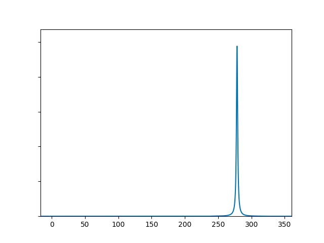
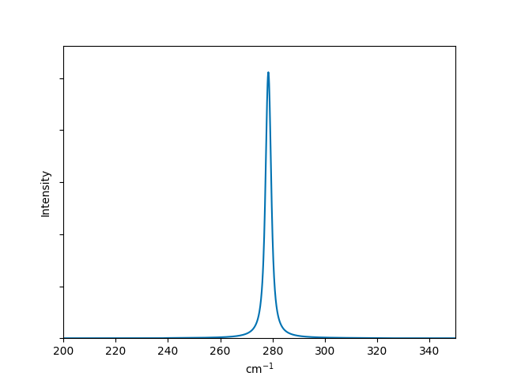
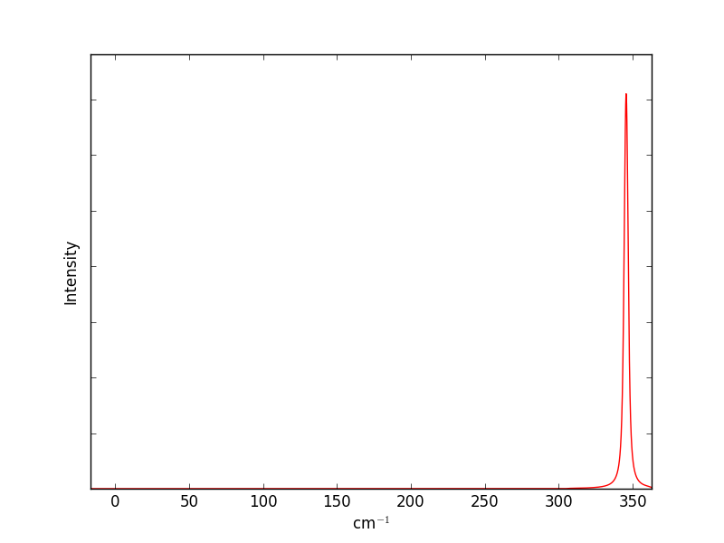
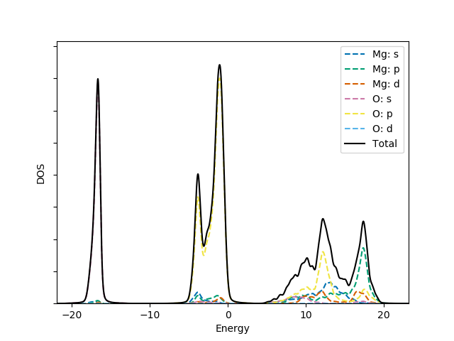
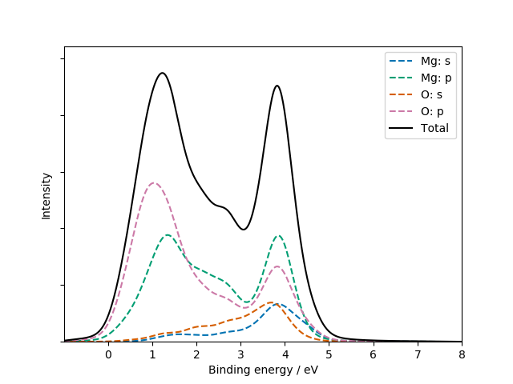
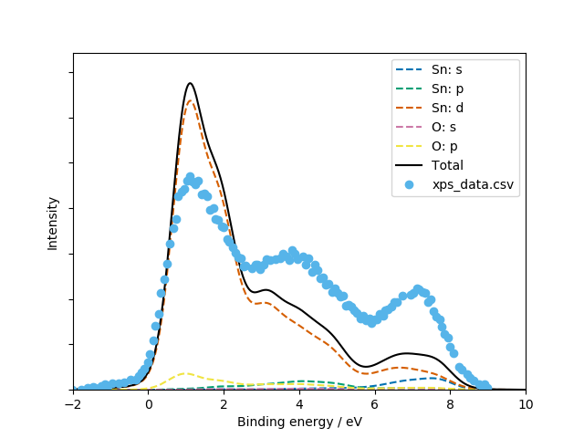
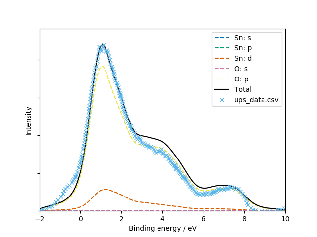

Tutorials
=========

Simulated IR
------------

The first-order infra-red absorption spectrum can be simulated by
performing lattice dynamics calculations to obtain the Γ-point
vibrational mode frequencies. The dielectric response of the system
determines the relative intensities of the modes, and some will be
inactive for symmetry reasons.

If you have the VASP quantum chemistry code, the simplest way to
compute these properties is with a single DFPT calculation
(e.g. ``IBRION = 7``, ``LEPSILON = .TRUE.``, ``NWRITE = 3``)
and follow-up with
`David Karhanek's analysis script <http://homepage.univie.ac.at/david.karhanek/downloads.html#Entry02>`__.
A sample output file is provided for CaF\ `2`:sub: (computed within
the local-density approximation (LDA) using a 700 eV plane-wave
cutoff) is included as *test/CaF2/ir_lda_700.txt*.

This file (found as *intensities/results/results.txt* after running the script) uses
a three-column space-separated format understood by Galore. To plot
the spectrum to screen with some broadening then we can use:

.. code-block:: bash

  galore test/CaF2/ir_lda_700.txt -g 0.5 -l --plot

Breaking down this command: First we provide the path to a data
file. This can also appear elsewhere in the argument string, but as
many flags take optional arguments it is safest to put it
first. ``-g`` applies Gaussian broadening; here we specify a width of
0.5. This will use the same units as the x-axis; in this case cm\
`-1`:sup:. ``-l`` applies Lorentzian broadening; as no width is
specified, the default 2 cm\ `-1`:sup: will be used. This is generally
a sensible value for optical measurements, but some tuning may be
needed.  Finally ``--plot`` will cause Galore to print to the screen
using Matplotlib. (``-p`` can also be used a short form.)

To see the full list of command-line arguments you can use ``galore
-h`` or check the :doc:`cli` section in this manual.

Admittedly, it isn't the most exciting spectrum, with a single peak
around 280 cm\ `-1`:sup:. Let's make some adjustments: we'll add a
touch more Gaussian broadening, zoom in on the peak by limiting the
axis range, add axis labels and write to a file.

.. code-block:: bash

  galore test/CaF2/ir_lda_700.txt -g 1.2 -l \
    --plot ir_lda_700_better.png \
    --xmin=200 --xmax=350 --units cm-1 --ylabel Intensity

Now the plot is more publication-ready! If you would like to use
another plotting program, the broadened data can be output to a CSV
file by simply replacing ``--plot`` with ``--csv``:

.. code-block:: bash

  galore test/CaF2/ir_lda_700.txt -g 1.2 -l --csv --xmin=200 --xmax=350

This will write a csv file to the standard output as no filename was
given. We can also write space-separated text data, so for example

.. code-block:: bash

    galore test/CaF2/ir_lda_700.txt -g 1.2 -l --txt ir_CaF2_broadened.txt

generates a file with two columns (i.e. energy and broadened intensity).

Simulated Raman
---------------

Broadening a simulated Raman spectrum is very similar to broadening a
simulated IR spectrum. Galore recognises the output format of the
`vasp_raman.py <https://github.com/raman-sc/VASP>`__ code, which
automates the process of following vibrational modes and calculating
the polarisability change on each displacement. The output file has a
simple format and Galore recognises them by inspecting the header.
Sample data is included (computed with LDA using VASP with a 500 eV
cutoff) as *test/CaF2/raman_lda_500.dat*. We generate a plot in the
same way as before:

.. code-block:: bash

    galore test/CaF2/raman_lda_500.dat -g -l --plot --units cm-1 --ylabel Intensity

Note that for the same material we are seeing a single peak again, but
at a different frequency to the IR plot. This is not a shift; the peak
at 280 cm\ `-1`:sup: is still present but has zero activity, while the
peak calculated at 345 cm\ `-1`:sup: has zero IR activity.

Simulated Photoionization Spectroscopy
--------------------------------------

Photoionization measurements allow valence band states to be probed
fairly directly; energy is absorbed by an incident photon as it ejects
an electron from the sample, and the shift in energy is measured
relative to a monochromatic photon source. Ultraviolet photoelectron
spectroscopy (UPS), x-ray photoelectron spectroscopy (XPS) and Hard
x-ray photoelectron spectroscopy (HAXPES) are fundamentally similar
techniques, differing in the energy range of the incident photons.

These binding energies may be compared with the full density
of states (DOS) computed with *ab initio* methods. However, the
intensity of interaction will vary depending on the character of the
energy states and the energy of the radiation source. The relevant
interaction parameter ("photoionization cross-section") has been
calculated systematically over the periodic table and relevant energy
values; Galore includes some such data from
`Yeh and Lindau (1985) <https://doi.org/10.1016/0092-640X(85)90016-6>`__.

In *ab initio* codes it is often possible to assign states to
particular orbital characters; often this is limited to s-p-d-f
(i.e. the second quantum number) but in principle an all-electron
code can also assign the first quantum number. Directional character
is also sometimes assigned, usually relative to the crystallographic
axes. These various schemes are used to construct a "projected density
of states" (PDOS).

The construction of a PDOS in *ab initio* calculations is slightly
arbitrary and lies beyond the scope of Galore. However, when the
orbital assignment has been made the DOS elements can be weighted to
simulate the photoionization spectrum.

We begin by plotting a PDOS from sample data in *test/MgO*. This was
computed using VASP with standard pseudopotentials and the revTPSS
exchange-correlation functional.

.. code-block:: bash

     galore test/MgO/MgO_Mg_dos.dat test/MgO/MgO_O_dos.dat \
       --plot --pdos -g 0.2 -l 0.2 --ylabel DOS

Note that the ``--pdos`` flag is required to interpret the multiple
input files. The element identity is read from these filenames, and is
expected between two underscore characters. The orbital names are
determined from the column headers in this file.

Let's turn this into a useful XPS plot. The flag ``--weightings`` can
be used to pass a data file with cross-section data, but data for Al
k-α radiation is built into Galore. We also flip the x-axis with
``--flipx`` to match the usual presentation of XPS data as positive
ionisation or binding energies rather than the negative energy of the
stable electron states. We'll also write the data to a CSV file with
the ``--csv`` option.

.. code-block:: bash

    galore test/MgO/MgO_Mg_dos.dat test/MgO/MgO_O_dos.dat \
      --plot mgo_xps.png --pdos -g 0.2 -l 0.2 --weighting xps \
      --units ev --xmin -1 --xmax 8 --ylabel Intensity \
      --csv mgo_xps.csv --flipx

Plotting the CSV file with a standard plotting package should give a
similar result to the figure above; if not, please report this as a
bug!

Compare with literature: tin dioxide
------------------------------------

Sample VASP output data is included for rutile tin dioxide. This was
computed with the PBE0 functional, using a 4x4x5 **k**-point mesh and
700 eV basis-set cutoff.  The structure was optimised to reduce forces
to below 1E-3 eV Å\ `-1`:sup: using 0.05 eV of Gaussian broadening and
the DOS was computed on an automatic tetrahedron mesh with Blöchl
corrections. Instead of the separate .dat files used above, we will
take advantage of Galore's ability to read a compressed *vasprun.xml*
file directly. This requires the Pymatgen library to be installed::

  pip3 install --user pymatgen

XPS
^^^

We have digitised the experimental data plotted in Fig.3 of
`Farahani et al. (2014) <https://doi.org/10.1103/PhysRevB.90.155413>`__
in order to aid a direct comparison::

  galore test/SnO2/vasprun.xml.gz --plot -g 0.3 -l 0.3 \
    --pdos --w XPS --flipx --xmin -2 --xmax 10 \
    --overlay test/SnO2/xps_data.csv  --overlay_offset -4 \
    --overlay_scale 120 --units ev --ylabel Intensity

(Note that here the shorter alias ``-w`` is used for the XPS
weighting.)  As in the paper, the experimental results have been
automatically scaled to the top of the peak. The general character and
peak positions match well, but the relative peak intensities could be
closer; the second peak which aligns with Sn p states is a bit weak
and gets lost in the Sn d states.

A slightly more generous assignment of 'p' vs 'd' character by the
orbital projection scheme would have made for a better fit! The
published results seem to fit better despite using similar calculation
parameters; we can't see if the orbital breakdown is indeed the
determining factor.

UPS
^^^

Experimental UPS data was digitized from Fig. 1 of `Themlin et
al. (1990) <https://doi.org/10.1103/PhysRevB.42.11914>`__. A
satisfactory fit is obtained for the three main peaks, but the "bump" below
zero suggests the presence of some phenomenon in the bandgap which was
not captured by the *ab initio* calculation::

  galore test/SnO2/vasprun.xml.gz --plot -g 0.3 -l 0.3 \
    --pdos --w XPS --flipx --xmin -2 --xmax 10 \
    --overlay test/SnO2/xps_data.csv  --overlay_offset -4 \
    --overlay_scale 120 --units ev --ylabel Intensity

The authors noted this in their own comparison to a DOS from
tight-binding calculations:

  The location of the VBM in out UPS data was complicated by the
  presence of a slowly varying photoelectron signal, resulting from a
  surface-state band.

HAXPES
^^^^^^

.. image:: figures/sno2_haxpes_data.png
           :alt: Simulated XPS for SnO2 overlaid with experimental data
           :align: center
           :scale: 50%

A HAXPES spectrum was obtained by digitizing Fig. 1 of `Nagata et
al. (2011) <https://doi.org/10.1063/1.3596449>`__. These experiments
were performed with 5.95 keV x-rays, while the weighting parameters
from Yeh and Lindau are for 8.05 keV so an exact match is unlikely::

   galore test/SnO2/vasprun.xml.gz --plot -g 0.3 -l 0.5 --pdos \
     --w haxpes --flipx --xmin -2 --xmax 10 \
     --overlay test/SnO2/haxpes_data.csv --overlay_offset -4 \
     --ylabel Intensity --overlay_style -

We see that the weighting goes some way to rebalancing the peak
intensities but once again the Sn-d states are over-represented.
Surface states above the valence band are also seen again.
